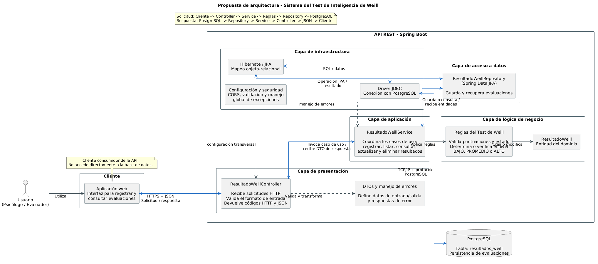

# Propuesta de arquitectura — Test de Inteligencia de Weill

Propuesta de arquitectura para transformar el **Sistema del Test de Inteligencia de Weill** en una API REST desarrollada con Spring Boot y respaldada por PostgreSQL.

> Primer Corte Evaluativo — Taller #1: Propuesta de Arquitectura de Servicios Web con Spring Boot.

## Integrantes

- Fernando Reyes
- Max Martinez
- Jorddy Siezar
- Emilio Carranza
- Victor Cabrera

## Proyecto retomado

El Sistema del Test de Inteligencia de Weill permite administrar los resultados obtenidos por los participantes. Cada resultado contiene el nombre y correo del participante, edad, fecha de aplicación, puntuación, nivel obtenido y estado de finalización.

La arquitectura propuesta toma como referencia las funcionalidades CRUD del módulo Weill desarrollado anteriormente en `Taller2_ServiciosWeb`. A diferencia de ese prototipo, que almacenaba los registros temporalmente en memoria, la nueva solución propone persistencia permanente en PostgreSQL.

## Problema que resuelve

La solución centraliza las evaluaciones del Test de Weill y permite que un psicólogo o evaluador pueda registrarlas, consultarlas, corregirlas y eliminarlas desde una aplicación web. La API actúa como intermediaria entre el cliente y la base de datos para aplicar validaciones y reglas de negocio de manera controlada.

## Diagrama de arquitectura



El código fuente editable del diagrama está disponible en [docs/diagrama-arquitectura-weill.puml](docs/diagrama-arquitectura-weill.puml).

## Arquitectura propuesta

| Componente o capa | Responsabilidad |
|---|---|
| Aplicación web | Permite al evaluador utilizar el sistema y consume la API mediante HTTPS y JSON. |
| Presentación | Recibe solicitudes HTTP, valida el formato de entrada y construye respuestas JSON con códigos HTTP. |
| Aplicación | Coordina los casos de uso por medio de `ResultadoWeillService`. |
| Lógica de negocio | Aplica las reglas del Test de Weill y valida la coherencia de la puntuación, nivel y estado. |
| Acceso a datos | Utiliza `ResultadoWeillRepository` para guardar y recuperar evaluaciones. |
| Infraestructura | Contiene JPA/Hibernate, JDBC, configuración, CORS, validación y manejo global de errores. |
| PostgreSQL | Conserva permanentemente los resultados del test. |

## Flujo de comunicación

### Solicitud

```text
Usuario → Aplicación web → HTTPS/JSON → Controller → Service
        → Reglas de negocio → Repository → JPA/JDBC → PostgreSQL
```

### Respuesta

```text
PostgreSQL → JPA/JDBC → Repository → Service → Controller
           → HTTPS/JSON → Aplicación web → Usuario
```

El cliente no accede directamente a PostgreSQL. Todas las operaciones pasan por la API para garantizar que se ejecuten las validaciones y reglas correspondientes.

## Servicios REST propuestos

| Funcionalidad | Método | Endpoint | Descripción |
|---|---|---|---|
| Registrar resultado | `POST` | `/api/resultados-weill` | Registra una nueva evaluación después de validar sus datos. |
| Listar resultados | `GET` | `/api/resultados-weill` | Devuelve todas las evaluaciones registradas. |
| Consultar resultado | `GET` | `/api/resultados-weill/{id}` | Busca una evaluación mediante su identificador. |
| Actualizar resultado | `PUT` | `/api/resultados-weill/{id}` | Actualiza los datos de una evaluación existente. |
| Eliminar resultado | `DELETE` | `/api/resultados-weill/{id}` | Elimina una evaluación mediante su identificador. |

### Ejemplo de información intercambiada

```json
{
  "nombreParticipante": "Ana López",
  "correo": "ana@example.com",
  "edad": 24,
  "fechaAplicacion": "2026-09-10",
  "puntuacion": 82,
  "nivel": "ALTO",
  "finalizado": true
}
```

## Tecnologías y protocolos

- Java 17 y Spring Boot.
- Spring Web MVC para la API REST.
- Spring Data JPA e Hibernate para persistencia.
- PostgreSQL como sistema gestor de base de datos.
- HTTPS como protocolo de comunicación externa.
- JSON como formato de intercambio de información.
- JDBC y protocolo PostgreSQL para la comunicación con la base de datos.
- PlantUML para documentar la arquitectura.

## Justificación

La arquitectura en capas separa la comunicación HTTP, la coordinación de los casos de uso, las reglas del test y la persistencia. Esta separación facilita las pruebas, el mantenimiento y futuras ampliaciones. PostgreSQL evita la pérdida de información que ocurría con el almacenamiento en memoria, mientras que los DTO controlan la información expuesta por la API.

## Documentación adicional

La explicación detallada de la propuesta, los flujos, códigos HTTP y responsabilidades se encuentra en [docs/propuesta-arquitectura-weill.md](docs/propuesta-arquitectura-weill.md).

## Alcance de la actividad

Este repositorio presenta el **diseño arquitectónico** solicitado. La actividad no requiere implementar todos los endpoints; estos se documentan como los servicios que serán desarrollados posteriormente.
